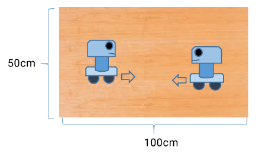
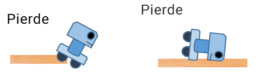
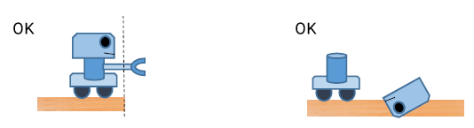
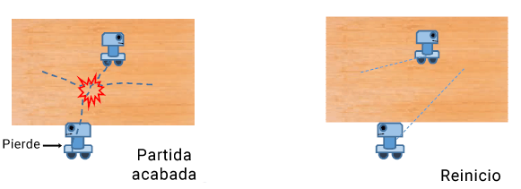

# Regulamento de HEBOCON

- Revisión 1 (2016): vixente Rev. 1

### Descrición da proba

É unha competición de sumo para robots, unha versión modificada do estilo de loita de sumo xaponés. A competición está destinada para aqueles que son técnicamente desfavorecidos. Sólo se permite a participación de robots do tipo ["Heboi"](http://portal.nifty.com/hebocon/whats_en.htm)

#### Regulamento básico

O taboleiro onde se combate será un contrachapado cun tamaño de 100 x 50 cm. Ambos robots comezan a batalla ao mesmo tempo dende lados opostos. Non é preciso que sexa dende as esquiñas.

O primeiro robot en sair do taboleiro é o que perde (cunha excepción, ver Regulamento para baixa tecnología).

Se un robot se cae, perde.

Non se teñen en conta como derrota as seguintes situacións, e polo tanto a partida debe continuar:

- Algunha parte do robot, que non está en contacto directo co chan, está fora do taboleiro.
- Parte do robot se desprende, quedando esa peza dentro ou fora do taboleiro.

### Regulamento para baixa tecnoloxía

O regulamento establecido de aquí en diante concebíuse co propósito de dar unha oportunidade de facelo ben aos robots máis imperfectos.

Excepción: Se un robot sae do taboleiro sen que entrara en contacto co outro robot, invalídase o combate e vólvese a comezar o enfrontamento. Esta regra ten o propósito de evitar estar en desvantaxe aos robots con mala maniobrabilidade e aqueles que se moven en liña recta a alta velocidade. Esta norma só é aplicable dúas veces por enfrontamento. Á terceira vez que ocorra, esta norma non se aplica.

O límite de tempo do enfrontamento é dun minuto. Se ao chegar ese tempo aínda non está claro o vencedor, este será o que percorrera unha distancia superior. Esta regra ten o propósito de evitar robots que non se moven.

### Progresión do torneo e premios

- Os enfrontamentos levaranse a cabo segundo a tabla de cruces do torneo.
- O gañador de cada enfrontamento leva 10 puntos.
- A penalización por incumprir o regulamento do uso de alta tecnoloxía é de 6 puntos por característica en cada enfrontamento. Normalmente, o gañador das eliminatorias sería o gañador da competición, pero se a súa puntuación total vese afectada por incumprir as regras de alta tecnoloxía, podería haber outro gañador se tivera unha puntuación superior.
- O feito de participar nunha competición de Hebocon é un premio en si mesmo. É posible que non haxa premios materiais, ou tal vez xuntemos tódalas pezas que foran perdendo outros robots e chas entreguemos como premio. Simplemente desfruta do momento de Hebocon.

### Especificacións dos robots

Por favor, participa cun robot que satisfaga os seguientes requisitos:
- É técnicamente mediocre. Ver parágrafo Regulamento para o uso de alta tecnoloxía, a continuación.
- Non ten dispositivos que destruan deliberadamente ao opoñente, como por exemplo un trade eléctrico.
- O tamaño máximo pode ser de 50cm de ancho por 50cm de longo. Non hai limitación en altura e o peso máximo non pode ser maior de 1 kg.

### Regulamento para o uso de alta tecnoloxía (penalizacións)

No caso de que o robot posúa algunhas das seguintes características debido ás habilidades do seu creador, o creador será penalizado por demostrar unhas capacidades técnicas excesivamente altas.

- Control remoto.
- Controis automáticos (activacións automáticas programadas pola obtención de datos de cualquera tipo de sensor, contador de tempo, medidor de distancia percorrida, etc)
- Outras cousas que os xuíces consideren de alta tecnoloxía.

A penalización só será aplicada nas batallas onde a característica de alta tecnoloxía se tivera utilizado.

A penalización non será aplicada no caso de que haxa una caracteristica de alta tecnoloxía, pero non se implementara polas capacidades técnicas do seu creador. Por exemplo, un robot composto dun coche de radiocontrol cun disfraz de conexo, posto que o creador non está relacionado coa creación dese sistema de control remoto.

Os participantes poderán comprobar con antelación se o seu robot pode ser penalizado polo uso de alta tecnoloxía cos organizadores.

A penalización reduce seis puntos por uso dunha característica de alta tecnoloxía. En caso de que haxa múltiples características de alta tecnoloxía, se rebaixarán máis puntos.

### Para ir quentando

Este é o regulamento, se estás pensando en participar nunha competición de Hebocon, por favor asegúrate de ler o documento titulado ["What is Hebocon"](http://portal.nifty.com/hebocon/whats_en.htm). Hebocon non consiste en gañar o campionato, o máis importante aquí é gozalo.

Esta obra está baixo una [licenza de Creative Commons Recoñecemento 4.0 Internacional (CC-BY)](http://creativecommons.org/licenses/by/4.0/).

Regulamento extraído de [Hebocon Official Rule](http://portal.nifty.com/hebocon/rules_en.htm).
