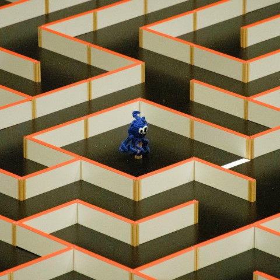
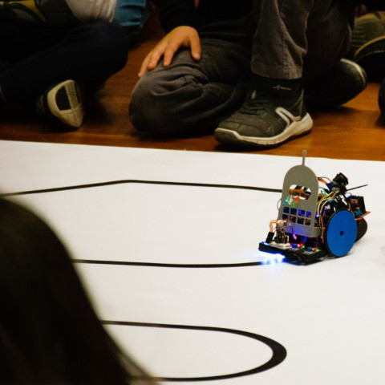
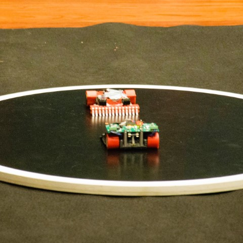
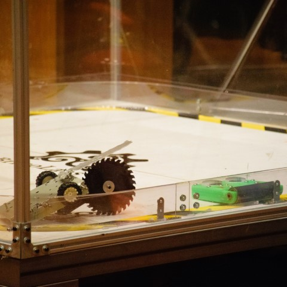
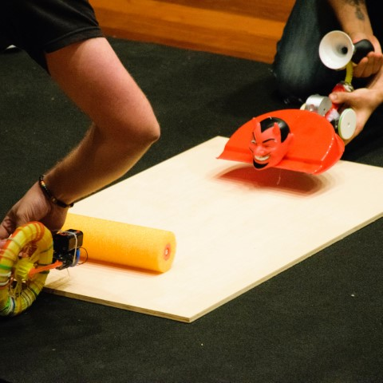
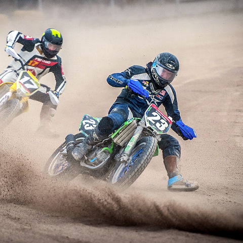
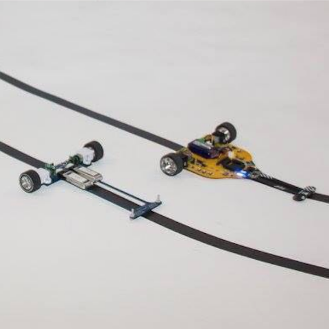

  

    

## Labirinto

    

  

  

    

## Segueliñas

    

  

  

    

## Mini sumo

    

  

  

    

## Combate

    

  

  

    

## Hebocon

    

  

  

    

## Velocistas

    

  

  

    

## Persecución

[Photo credits](https://github.com/open-robosports/normativa-velocistas)

    

  

