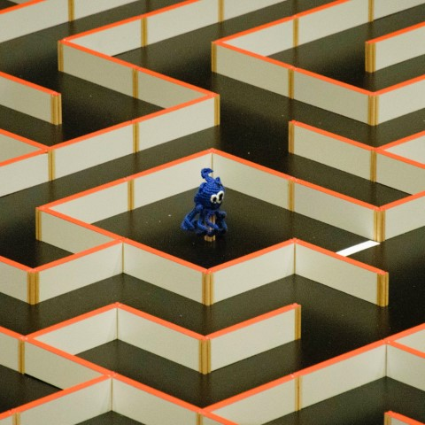
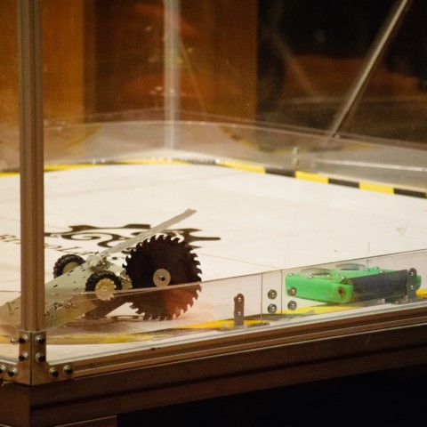
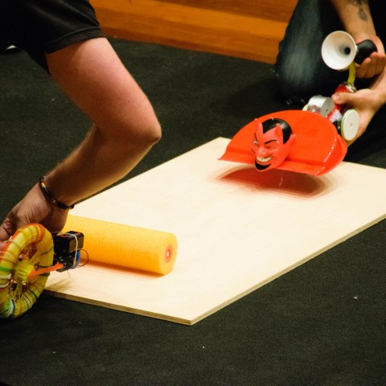
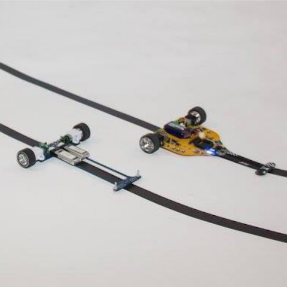

  

    

## Laberinto

    

  

  

    

## Siguelíneas

    

  

  

    

## Mini sumo

    

  

  

    

## Combate

    

  

  

    

## Hebocon

    

  

  

    

## Velocistas

    

  

  

    

## Persecución

[Photo credits](https://github.com/open-robosports/normativa-velocistas)

    

  

