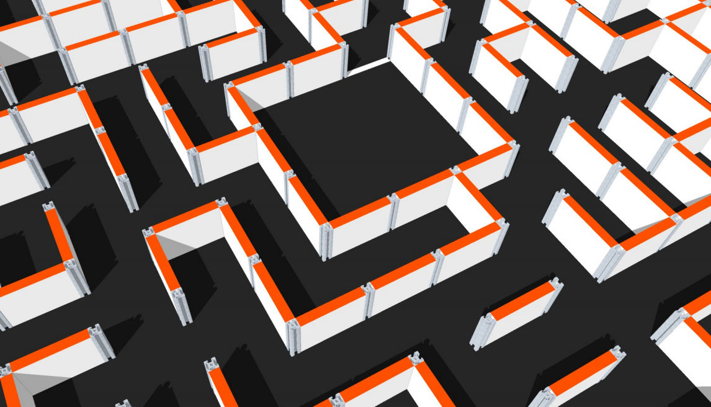

# Reglamento de Laberinto

  - Revisión 1 (2015): vigente desde OSHWDem 2015

### Objetivo

Un robot autónomo debe resolver un laberinto y completar su recorrido desde la celda de salida hasta la celda de llegada en el menor tiempo posible.

Dispondrá de 5 minutos para reconocer el laberinto y 3 intentos para completarlo en el menor tiempo que pueda. Ganará la competición el robot que complete el recorrido en el menor tiempo.

### El laberinto

1. El laberinto está formado por un área de 13 por 13 celdas, que vienen siendo estancias de forma cuadrada y adyacentes por cada uno de sus lados del perímetro de la propia celda.

2. Cada celda tiene un tamaño de 150 por 150 milímetros, y sobre cada uno de sus lados de la celda puede existir, o no, una pared que no dejará pasar al robot por ese lateral.

3. Las paredes del laberinto tienen una altura de 100mm, un grosor de 20mm y van situadas sobre el medio y medio de las celdas que separa.

4. Hay que tener en cuenta que una pared invade el espacio de las dos celdas y reducen el área de cada celda, achicándola 10mm por el lado de la pared e, por lo tanto, dejando los corredores por los que tiene que pasar el robot en 130mm de ancho.

5. Se asume un 5% de tolerancia en todas las dimensiones dadas.

6. Los lados de las celdas que delimitan el exterior del laberinto estarán todas cerradas por paredes, evitando que el robot salga del laberinto.

7. Los lados de las paredes son de color blanco, la parte superior de las paredes es de color naranja y el suelo es de color negro. Las partes del laberinto son de madera, acabada con pintura mate.

8. Debe asumirse que las tonalidades y acabados de la pintura puedan variar a lo largo del recorrido, existir zonas de sombras por la iluminación ambiental y variaciones en la cantidad de fricción que ofrece el suelo. Las columnas que sujetan las divisiones son de aluminio extruído, en color natural y quedan a la vista del robot.

9. En el suelo puede existir la unión de tableros de madera que podrían provocar un pequeño desnivel que se tratará de minimizar para evitar que los robots puedan ser afectados.

10. El punto de partida o “salida” está situado en una de las cuatro esquinas del laberinto.

11. El punto de llegada o “meta” está situado en el centro del laberinto.

12. La meta está compuesta de un área de 3 por 3 celdas con paredes sólo en su perímetro excepto en la entrada, que será tan sólo de una pared en una celda y que se denomina “puerta de meta”.

13. La zona de meta tendrá una marca en el suelo que indicar al robot la zona de llegada.
Dicha marca será una línea blanca de 2cm de grosor.

14. Para la generación del laberinto se va a utilizar el siguiente repositorio: [https://github.com/brico-labs/OshwdemMazes](https://github.com/brico-labs/OshwdemMazes). El programa se ejecutará justo antes del comienzo de la prueba y servirá para configurar las paredes del laberinto.

### Los robots

1. La placa controladora del robot, en caso de haberla, debe estar basada en tecnologías abiertas. También son válidas las plataformas o kits de robótica basados en tecnologías abiertas.

2. El funcionamiento del robot debe ser completamente autónomo. Se puede utilizar cualquier método de control, siempre y cuando esté integrado enteramente en el robot y no reciba señales o indicaciones externas (de cualquier tipo).

3. No existe limitación en cuanto a masa, dimensiones o geometría del robot, con la única excepción de la altura, que no debe superar, en ningún caso, los 95mm. El robot debe ser una única unidad indivisible.

4. El robot no podrá saltar por encima, sobrevolar, escalar, cortar, rascar, quemar, dañar o destruir las paredes del laberinto.
5. El robot debe tener un nombre o número con fines de registro y seguimiento. El robot debe mostrar este nombre o número para permitir su identificación a la organización y jueces y a los espectadores.

6. Los robots deben funcionar únicamente con la energía proporcionada por pilas o baterías eléctricas integradas en el propio robot.

### Desarollo de la competición

1. El orden de participación vendrá dado por el orden de llegada o anotación en la lista de inscritos al competición. Se avisará con antelación al desarrollo del mismo el orden de participación de cada robot.

2. Momentos antes del comienzo del competición se revelará el recorrido del laberinto. Desde ese mismo instante los robots deben estar en la mesa de los jueces y no se permite ningún cambio de pieza, carga de programa o comunicación remota con el robot.

3. Cada participante podrá inscribir y participar con hasta tres robots, pero solamente podrá tener la opción a uno de los premios si uno o varios de sus robots resultan ganadores.

4. Los robots podrán acceder o ser retirados del laberinto únicamente por orden de los jueces.

5. Cada robot dispondrá de 5 minutos para reconocer el laberinto. El tiempo comienza a contar en el momento que el juez da la orden y acaba al finalizar el tiempo dispuesto o en cualquier momento por decisión del participante.

6. Solamente durante el tiempo de reconocimiento, el operador del robot podrá reiniciar el recorrido o reconocimiento tantas veces como quiera, además de llevar a cabo las siguientes operaciones:

    1. Ajuste electrónico, mediante controles integrados en el robot, de la configuración que no aporte información relativa al recorrido del laberinto.
    2. Ajuste manual de los sensores o de los elementos motrices del robot.
    3. Sustitución de las baterías.
    4. Hacer reparaciones de piezas dañadas o sustituirlas por otras que tengan similares características que la pieza dañada.

7. Dentro del tiempo de reconocimiento del laberinto, el robot que consiga entrar a la zona de meta podrá seguir operativo o continuar cartografiando el laberinto hasta que finalice el tiempo establecido.

8. Una vez transcurrido el tiempo de reconocimiento, el robot tendrá 3 intentos para completar el recorrido del laberinto desde la zona de salida hasta la zona de meta en el menor tiempo posible. El juez indicará cuando comienza y finaliza cada intento.

9. El cronómetro se pondrá en marcha cuando el robot toca la línea divisoria de la celda de salida.

10. El cronómetro parará cuando el robot supera completamente la puerta de meta.

11. El operador del robot podrá realizar los ajustes, entre cada intento, de acuerdo a las operaciones detalladas en el punto 6.i y 6.ii de esta misma sección.

12. En caso de colisión con las paredes del laberinto o detención del robot por más de 10 segundos sin que este tenga intención de moverse o de progresión en el recorrido, se perderá el intento en curso.

13. El tiempo a tener en cuenta para la competición con otros robots será el menor de los tiempos en completar adecuadamente el recorrido del laberinto.   

### Ganadores de la competición

El robot que haya completado el laberinto en el menor tiempo será el ganador de la competición. El segundo y tercer clasificado será el que tenga el segundo y tercer menor tiempo respectivamente.

En caso de empate o falta de puntuación para alguno de los clasificados, los jueces determinarán los ganadores en función de las características técnicas del robot, comportamiento en el laberinto u otros factores.

Cada participante podrá llevar sólo un premio de los tres establecidos.

### Jueces

En la sala habrá en todo momento una persona identificada como “juez principal” y será la encargada de comunicar cualquier decisión final con respecto al desarrollo del competición e interpretación de las normas.

Otras personas pueden estar identificadas como “juez asistente” y ayudarán al juez principal en las tareas que tenga delegadas. El participante siempre se debe dirigir al juez principal para cualquier reclamación o aclaración de las normas. Entonces, si el juez principal lo estima oportuno, puede redirigir al participante a un juez asistente.

Las decisiones finales siempre las toma el juez principal.

### Recursos de interés 

  * [Repositorio para la generación de laberintos](https://github.com/brico-labs/OshwdemMazes)
  * [Solving a Maze](https://www.cs.bu.edu/teaching/alg/maze/)
  * [Think Labyrinth!](http://www.astrolog.org/labyrnth.htm)

----

Esta obra está bajo una [licencia de Creative Commons Reconocimiento 4.0 Internacional (CC-BY)](http://creativecommons.org/licenses/by/4.0/).
