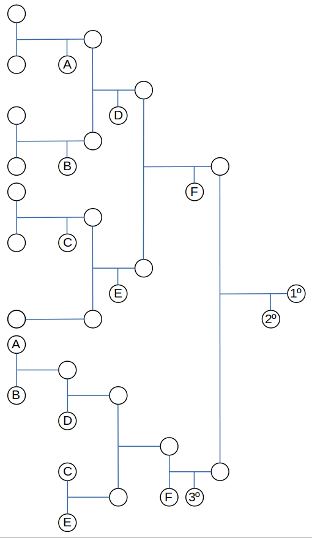

### Reglamento de Mini Sumo

  - Revisión 4 (2019): vigente desde OSHWDem 2019

##### Objetivo

Dos robots compiten entre sí simulando los enfrentamientos humanos de sumo. No se permite a los robots la utilización de armas ni girar sobre sí mismos, y el único objetivo es empujar al robot oponente para sacarlo del Dohyo. El torneo se lleva a cabo mediante el sistema de eliminación simple al mejor de 3 asaltos. El robot que primero consiga dos puntos pasará a la siguiente fase del torneo.

El reglamento se detalla a continuación.

#### Sección 1: Definición de los enfrentamientos de Sumo Robot

##### Artículo 1.- Definición
Un enfrentamiento se libra entre dos participantes. De acuerdo con las reglas del juego (en adelante "el presente Reglamento") cada participante compite en un Dohyo (ring de sumo) con un robot construido por el/la participante según lo especificado en la Sección 3. Los asaltos comienzan a las órdenes del juez y continúa hasta que un participante gana dos puntos. El juez determina el ganador del enfrentamiento.

#### Sección 2: Requisitos del Dohyo

##### Artículo 2.- Interior del Dohyo
El interior del Dohyo se define como la superficie de juego rodeada de una línea en el borde, que también forma parte de la superficie de juego. Cualquier lugar fuera de esta área se considera el exterior del Dohyo.

##### Artículo 3.- Especificaciones del Dohyo

1. El Dohyo será de forma circular y de unas dimensiones adecuadas para cada clase de robot.
2. Las líneas de inicio (shikiri-sen) constan de dos líneas paralelas pintadas en color marrón (o equivalente para la absorción de la luz IR) centradas en el Dohyo, con unas dimensiones y espacio de separación adaptadas a cada clase de robot. La distancia de separación entre las líneas se mide a sus bordes exteriores.
3. La línea del borde se marca como un anillo circular blanco de un ancho apropiado para cada clase de robot, en el borde exterior de la superficie de juego. El área del Dohyo se extiende hasta el borde exterior de esta línea circular.

**Especificaciones del Dohyo**

| Clase | Altura | Diámetro | Material | Grosor* | Longitud* | Separación* | Ancho borde |
| :---- | :----: | :------: | :------: | :-----: | :--------: | :---------: | :---------: |
| Mini  |  19mm  |   77 cm  |    MDF   |   2 cm  |  10 cm     | 10 cm       | 2,5 cm      |

* Líneas de inicio (shikiri-sen)
Estas medidas pueden variar un 5%

##### Artículo 4.- Exterior del Dohyo
Debe existir un espacio de **un metro** libre de obstáculos fuera del borde exterior del Dohyo para no confundir a los robots.
Este espacio puede ser de cualquier color, material o forma. Este área, con el Dohyo en el medio, se va a llamar el "área del Dohyo". Cualquier marca o parte de la plataforma del Dohyo fuera de las dimensiones mínimas también serán considerados en el área del Dohyo.

#### Sección 3: Reglamentación para los Robots

##### Artículo 5.- Especificaciones

1. La placa controladora del robot, en caso de haberla, debe estar basada en tecnologías abiertas. También son válidas las plataformas o kits de robótica basados en tecnologías abiertas.

2. El robot debe caber en un cubo de las dimensiones establecidas para cada clase. Un robot puede expandirse en tamaño una vez se da comienzo al enfrentamiento, pero no puede separarse físicamente en pedazos y debe seguir siendo un solo robot centralizado. Los robots que no cumplan esta restricción perderán el combate. Los tornillos, tuercas y otras partes del robot con una masa total de menos de 5 gramos que caigan del cuerpo de un robot no causarán la pérdida del combate.

3. La masa total de un robot al comienzo de un combate debe estar por debajo de la especificada para cada clase.

Clase | Altura | Anchura | Longitud | Masa
:--- | :---: | :---: | :---: | :---: |
**Mini** | ilimitada | 10 cm | 10 cm | 500 gr

4. Clases autónomas: Los robots de la clase Mini (500gr) deben ser autónomos. Se puede utilizar cualquier método de control, siempre y cuando esté integrado enteramente en el robot y no reciba señales o indicaciones externas (de cualquier tipo). El funcionamiento autónomo del robot no debe comenzar antes de 5 segundos después de ser iniciado por el usuario. Los robots que no respeten el intervalo de los 5 segundos pierden el punto de ese asalto.

5. El robot debe tener un nombre o número con fines de registro y seguimiento.
6. Se permite el uso de elementos afilados en el cuerpo del robot siempre y cuando no tengan la capacidad de dañar al robot contrario, el dohyo ni sus inmediaciones. Se requerirá además que los robots tengan sistemas de seguridad (como detención de forma remota) a aquellos robots que constituyan un peligro por su construcción o funcionamiento. Es decir, si un robot es muy rápido y además posee una cuchilla afilada para usarse como cuña, debe poder detenerse de forma segura.

##### Artículo 6.- Restricciones

1. Dispositivos para crear interferencias (jamming), como LED’s IR con la intención de saturar los sensores IR del oponente.

2. Partes que puedan dañar o romper el Dohyo. Usar partes que puedan dañar intencionadamente al robot oponente o a su operador. Los empujones y golpes derivados de estos no están considerados con intención de causar daño.

3. Dispositivos que puedan almacenar fluidos, polvo, gas u otras sustancias para lanzar al oponente.

4. Dispositivos de pirotecnia.

5. Dispositivos que lancen objetos al oponente.

6. La utilización de sustancias pegajosas para incrementar la tracción.

7. El uso de dispositivos para incrementar el “efecto suelo”, como bombas de vacío o imanes.

8. El uso de cualquier tipo de fuente de energía para el funcionamiento del robot que no sea la proporcionada por pilas o baterías eléctricas.

#### Sección 4: Desarrollo de los combates

##### Artículo 7.- Desarrollo de los combates
1. Cada combate consta de **tres asaltos**, con un tiempo total de tres minutos, a menos que sea extendido por los jueces.

2. El primer participante que gane dos asaltos, dentro del tiempo límite, será el ganador del combate. Un participante recibe un punto cuando gana un asalto. Si se alcanza el límite de tiempo antes de que un participante pueda obtener dos puntos y uno de los participantes ha recibido un punto, el participante con ese punto se considera el ganador del combate.
3. En cada uno de los asaltos de un mismo combate se irán alternando las orientaciones de los robots en la salida, en el siguiente orden: de frente, de lado, de espaldas.

4. Cuando haya un empate entre dos participantes y en función de la modalidad de competición, podría establecerse un nuevo asalto (asalto extendido), en cuyo caso se reiniciará el orden de salida, durante el cual el participante que consiga el punto se convertirá en el ganador del combate.

#### Sección 5: Comienzo, parada, reanudación y finalización de un asalto

##### Artículo 8.- Comienzo
Tras las instrucciones de los jueces, los dos participantes se acercarán al Dohyo y pondrán cada robot en su mitad del Dohyo, detrás de sus respectivas líneas de inicio, sin desplazarlo lateralmente. El robot o cualquier parte de este no puede ser colocado más allá de la línea de inicio hacia su oponente. No se requiere poner el robot pegado a la línea de inicio. Cuando el juez anuncie el comienzo del asalto, los participantes activarán sus robots y, después de **cinco segundos de espera**, los robots empezarán a operar. Durante estos cinco segundos los participantes deberán abandonar el área del Dohyo.

##### Artículo 9.- Parada y reanudación
Los asaltos se paran y reanudan por indicación de los jueces.

##### Artículo 10.- Finalización
Los saltos finalizan por indicación de los jueces. Los participantes podrán recuperar sus robots en el área del Dohyo.

#### Sección 6: Tiempo combate

##### Artículo 11.- Tiempo de combate
Un combate debe llevarse a cabo en un total de 3 minutos, que comenzarán y finalizarán por orden de los jueces.

##### Artículo 12.- Asalto extra
Si, por decisión de los jueces, se requiera un asalto extra, ésta tendrá una duración máxima
de 3 minutos.

##### Artículo 13.- Exclusiones de tiempo
Lo siguiente no está incluido dentro del tiempo de partida:

1. El tiempo transcurrido desde que los jueces anuncian el punto del asalto hasta el comienzo del siguiente asalto. El tiempo establecido entre asaltos es de 30 segundos.

2. El tiempo transcurrido desde que los jueces anuncian la parada del asalto hasta su reanudación.

#### Sección 7: Puntuación

##### Artículo 14.- Puntuación
Se considera que un robot ha ganado un asalto cuando:

1. Un participante fuerza al robot contrincante a tocar el área fuera del Dohyo, incluyendo el borde lateral del mismo.
2. El robot contrincante, por sí mismo, toca el área fuera del Dohyo, incluyendo el borde lateral del mismo.
3. El robot contrincante reincida en no respetar el intervalo de 5 segundos de espera al ponerse en funcionamiento, previo aviso de penalización por parte de los jueces.
4. El robot contrincante no comience a moverse antes de los 5 segundos posteriores a los 5 segundos de espera.

El asalto se considerará empate en las siguientes circunstancias:

1. Los robots están enredados u orbitando entre sí sin ningún progreso aparente durante 5 segundos. Si no está clara la intención de los robots, el juez puede prorrogar dicho plazo hasta un máximo de 30 segundos. 

2. Ambos robots se mueven sin intención de luchar, o se paran al mismo tiempo y permanecen detenidos durante 5 segundos sin tocarse. Sin embargo, si un robot detiene su movimiento en primer lugar, transcurridos cinco segundos será declarado como que no tiene intención de luchar. En este caso, el oponente recibirá un punto, incluso si éste último también se
detiene. Si los dos robots se mueven y no está claro si se están progresando, el juez puede prorrogar el plazo hasta un máximo de 30 segundos.

3. Los dos robots tocan el exterior del Dohyo más o menos al mismo tiempo, y no se puede determinar quién tocó en primer lugar.

4. Uno de los robots se sale por sí mismo del dohyo y el otro permanece parado durante los 5 segundos posteriores.

5. Se ha vencido el tiempo máximo del asalto y ninguno de los dos robots ha salido del Dohyo.

Un asalto se considera nulo cuando en los 5 segundos posteriores a los 5 segundos de espera:

	1. ninguno de los dos robots comienza a moverse.
	2. los robots se salen del dohyo sin tocarse.
	3. uno de los robots se sale del dohyo sin tocar al oponente y el otro no comience a moverse.
	
Si el asalto resulta nulo, se dará un aviso a los competidores y se repetirá una sola vez. Si vuelve a ser nulo, se considerará empate por inactividad.

Cuando se requiera la decisión de los jueces para determinar el ganador de un asalto se tendrán en cuenta las siguientes consideraciones:
    
    1. méritos técnicos en el movimiento y funcionamiento de un robot.
    2. las penalizaciones durante el asalto.
    3. actitud del participante durante el combate.

#### Sección 8: Sistema de competición
Se contemplan 3 modalidades de competición, a elección de la organización de la prueba y en función del tiempo y de los medios de los que dispongan para su realización. La modalidad elegida se comunicará a los participantes antes de la competición.

##### Modalidad de liga

En esta modalidad se realizan combates entre cada pareja de robots, de tal manera que cada robot termina enfrentándose a todos los oponentes. Se hará una tabla clasificatoria en la que se recojan los puntos obtenidos por cada robot y determine la clasificación final.

Puntuación final del combate:
Los robots ganan **2 puntos** en la clasificación por cada combate ganado y **1 punto** por cada combate empatado. Los puntos ganados en cada combate son independientes de los asaltos ganados.

Para ganar los **2 puntos** correspondientes a la victoria del combate hay que ganar **2 de los 3 asaltos**. Si solamente se gana **1 asalto** y se empatan **2 asaltos** por inactividad, no se ganan puntos.

Para ganar **1 punto** cada robot en caso de empate en el combate debe haber al menos **2 asaltos** con actividad de alguno de los robots.

En caso de empate entre 2 o más robots en los 3 primeros puestos de la clasificación final, se determinarán los puestos en función del número de asaltos ganados en los combates realizados entre los robots empatados. En caso de no poder determinarse, ya sea porque también hayan quedado empate a asaltos ganados en su combate o porque sea irresoluble al ser un empate entre varios robots, se podrán realizar nuevos combates entre los implicados, sin que se vean afectados el resto de puestos de la clasificación.

##### Modalidad de torneo

En la modalidad de torneo se realizan varios grupos de robots, los cuales se enfrentarán en ligas internas para determinar qué 2 robots se clasifican de cada grupo para las finales.

El número de grupos será una potencia de dos (2, 4, 8...) y el reparto de robots se hará equitativamente y en función de la clasificación del ranking de ORS o, en su defecto, por sorteo. Es posible que alguno de los grupos no quede lleno, por lo que los robots de ese grupo tendrían menos combates, pero igualmente se clasificarían 2 para las finales.

La fase de grupos seguirá el mismo procedimiento que el descrito para la modalidad de liga, teniendo que resolver los empates que existan en los dos primeros puestos de las respectivas clasificaciones.

La fase de las finales consta de varias rondas eliminatorias. El robot que gane un combate pasará a la siguiente ronda. Se realizará una final por el tercer puesto entre los robots eliminados en semifinales; y una final por el primer puesto entre los robots que consigan ganar todos los combates previos.

En la primera fase eliminatoria, los cruces se realizarán de tal manera que el primer clasificado de cada grupo se enfrentará en un combate contra el segundo del grupo adyacente. El número de rondas se determinará en función del número de robots clasificados, que a su vez vendrá determinado por el número de grupos.

Para ganar un combate y pasar a la siguiente ronda, se tienen que ganar **2 asaltos**. Si un asalto queda empate, tiene que repetirse inmediatamente. Nunca se repetirá un asalto resuelto, por ejemplo: si uno de los dos robots ya ha ganado saliendo de frente, ese asalto se da por concluido y no volverá a repetirse el inicio con los robots saliendo de frente.

A continuación se muestra un ejemplo de posible tabla de cruces para una competición en modalidad de torneo con 14 robots:

##### Modalidad de torneo aleatorio con repesca

Se trata de una modalidad de fases eliminatorias directas, pero con repesca por una segunda vía para poder acceder a las finales. Los cruces iniciales se realizan en función del ranking de ORS o, en su defecto, por sorteo. Con esta modalidad se evita que algún robot que pueda ser merecedero de llegar al podio pueda quedar eliminado en los primeros combates.

En cualquier caso, para eliminar a un robot, éste tendrá que perder al menos dos combates o ser eliminado en la final.

Este sistema se asemeja a la fase de finales de la modalidad de torneo, aplicando las mismas normas, pero con una segunda rama de repesca.

A continuación se muestra un ejemplo de posible tabla de cruces para una competición en la modalidad de torneo aleatorio con repesca con 7 robots:

#### Sección 9: Faltas
##### Artículo 15.- Faltas
Los participantes que realicen cualquiera de los hechos descritos en los Artículos 6, 16 o 17, serán amonestados por saltarse este reglamento.

##### Artículo 16.- Insultos
Un participante que profiere insultos al oponente o a los jueces, o pone voces en el robot que pronuncie palabras insultantes, o que aparezcan escritas en el cuerpo del robot, o que realice gestos insultantes, se considera una falta por incumplimiento de este reglamento.

##### Artículo 17.- Faltas leves
Se considera una falta leve cuando un participante:

1. Entra en el Dohyo durante el asalto, excepto cuando el participante lo hace para recoger el robot fuera del Dohyo una vez el juez anunció la asignación del punto o para el asalto. Entrar en el Dohyo significa:

    1. una parte del cuerpo del participante está en el Dohyo.
    2. un participante utiliza algún mecanismo para tocar el Dohyo.
    
2. Realiza las siguientes acciones:

    1. Exige parar el asalto sin razones aparentes.
    2. Tarda más de 30 segundos para comenzar el asalto, a menos que el juez incremente el tiempo.
    3. Poner en funcionamiento el robot dentro de los cinco segundos después de que el juez anuncia el comienzo del asalto.
    4. Hacer alusiones a la imparcialidad del asalto, el combate o el torneo.

#### Sección 10: Penalizaciones

##### Artículo 18.- Penalizaciones
Los jugadores que incumplan los artículos 6 y 16 del presente reglamento perderán el combate y serán descalificados del torneo. El juez otorga dos puntos al oponente.

##### Artículo 19.- Acumulación de faltas
Las faltas leves descritas en el artículo 17 son acumulativas a lo largo de todo el asalto. Dos
faltas leves conllevan otorgar un punto al oponente.

#### Sección 11: Jueces

##### Artículo 20.- Los jueces
En la sala habrá una persona identificada como "juez principal" y será la encargada de comunicar cualquier decisión final con respecto al desarrollo de la competición y la interpretación de las normas.

Otras personas pueden estar identificadas como "juez asistente" y ayudarán al juez principal en las tareas que tengan delegadas.

El participante siempre se debe dirigir al juez principal para cualquier reclamación o aclaración de las normas. Entonces, si el juez principal lo estima oportuno, puede redirigir al participante al juez asistente.

Las decisiones finales siempre las tomará el juez principal.

##### Artículo 21.- Declaración de objeciones
Un participante puede presentar objeciones a la organización antes de que termine el asalto, si hay alguna duda en el ejercicio de este reglamento. Si no hay miembros de la organización presentes, la objeción se puede presentar al juez antes de la finalización del asalto.

#### Sección 12: Miscelánea

##### Artículo 22.- Flexibilidad del reglamento
Siempre y cuando se respeten el concepto y fundamentos de las reglas, estas deberán ser lo suficientemente flexibles para abarcar cambios en el número de jugadores y en el contenido de las partidas.

##### Recursos de interés
[Listado de robots minisumo *Open Source*](https://open-robosports.github.io/kits/minisumo)

---

Esta obra está bajo una <a rel="license" href="http://creativecommons.org/licenses/by/4.0/">licencia de Creative Commons Reconocimiento 4.0 Internacional.</a>

Reglamento derivado de [Unified Sumo Robot Rules](http://robogames.net/rules/all-sumo.php).
