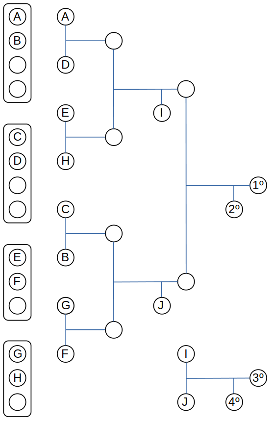
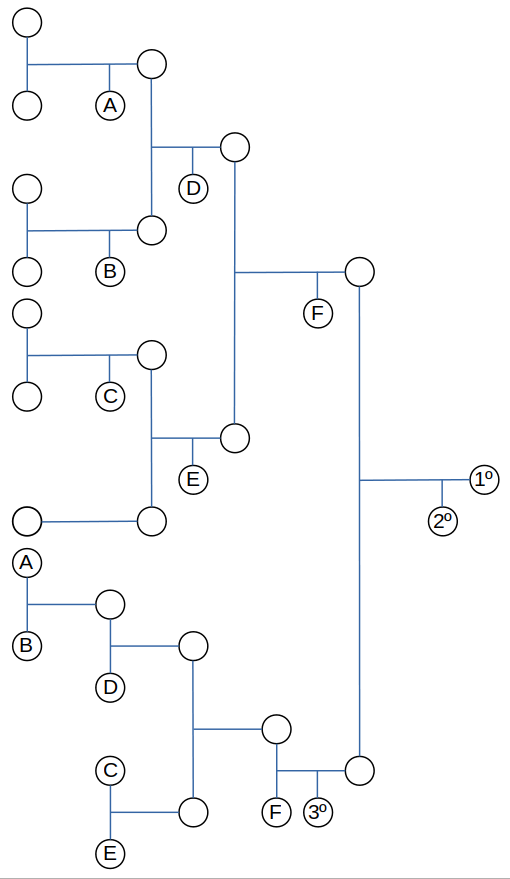

### Regulamento de Sumo (Minisumo)

  - Revisión 4 (2019): vixente dende OSHWDem 2019

##### Obxectivo

Dous robots compiten entre si simulando os enfrontamentos humanos de sumo. Non se permite aos robots a utilización de armas nin xirar sobre si mesmos, e o único obxectivo é empurrar ao robot opoñente para sacalo do Dohyo. O torneo lévase a cabo mediante o sistema de eliminación simple ao mellor de 3 asaltos. O robot que primeiro consiga dous puntos pasará á seguinte fase do torneo.

O regulamento completo detállase acontinuación.

##### Sección 1: Definición dos enfrontamentos de Sumo Robot

###### Artigo 1.- Definición
Un enfrontamento líbrase entre dous participantes. De acordo coas regras do xogo (en diante "o presente Regulamento") cada participante compite nun Dohyo (ring de sumo) cun robot construído polo/a participante segundo o especificado na Sección 3. Os asaltos comezan ás ordes do xuíz e continúa ata que un participante gaña dous puntos. O xuíz determina o gañador do enfrontamento.

##### Sección 2: Requisitos do Dohyo

###### Artigo 2.- Interior do Dohyo
O interior do Dohyo defínese como a superficie de xogo rodeada dunha liña no bordo, que tamén forma parte da superficie de xogo. Calquera lugar fóra desta área se considera o exterior do Dohyo.

###### Artigo 3.- Especificacións do Dohyo
1. O Dohyo será de forma circular e dunhas dimensións axeitadas para cada clase de robot.
2. As liñas de inicio (shikiri-sen) constan de dúas liñas paralelas pintadas en cor marrón (ou equivalente para a absorción da luz IR) centradas no Dohyo, cunhas dimensións e espazo de separación adaptadas a cada clase de robot. A distancia de separación entre as liñas mídese aos seus bordos exteriores.
3. A liña do bordo márcase como un anel circular branco dun ancho apropiado para cada clase de robot, no bordo exterior da superficie de xogo. A área do Dohyo esténdese ata o bordo exterior desta liña circular.

**Especificacións do Dohyo**

| Clase | Altura | Diámetro | Material | Grosor* | Lonxitude* | Separación* | Ancho Bordo |
| :---- | :----: | :------: | :------: | :-----: | :--------: | :---------: | :---------: |
| Mini  |  19mm  |   77 cm  |    MDF   |   2 cm  |  10 cm     | 10 cm       | 2,5 cm      |

* Liñas de inicio (shikiri-sen)
Estas medidas poden variar un 5%

###### Artigo 4.- Exterior do Dohyo
Debe haber un espazo, axeitado a cada clase de robot, fóra do bordo exterior do Dohyo. Este espazo pode ser de calquera cor, material ou forma. Este área, co Dohyo no medio, vaise chamar a "área do Dohyo". Calquera marca ou parte da plataforma do Dohyo fose das dimensións mínimas tamén serán considerados na área do Dohyo.

##### Sección 3: Regulamentación para os Robots

###### Artigo 5.- Especificacións

1. A placa controladora do robot, en caso de habela, debe estar baseada en tecnoloxías abertas. Tamén son válidas as plataformas ou kits de robótica baseados en tecnoloxías abertas.

2. O robot debe caber nun cubo das dimensións establecidas para cada clase. Un robot pode expandirse en tamaño unha vez dáse comezo ao enfrontamento, pero non pode separarse fisicamente en anacos e debe seguir sendo un só robot centralizado. Os robots que non cumpran esta restrición perderán o combate. Os parafusos, roscas e outras partes do robot cunha masa total de menos de 5 gramos que caian do corpo dun robot non causarán a perda do combate.

3. A masa total dun robot ao comezo de un combate debe estar por debaixo da especificada para cada clase. Para este torneo só se contempla unha única clase coas seguintes especificacións.

Clase | Altura | Anchura | Lonxitude | Masa
:--- | :---: | :---: | :---: | :---: |
**Mini** | ilimitada | 10 cm | 10 cm | 500 gr

4. Clases autónomas: Os robots da clase Mini (500 gr) deben ser autónomos. Pódese
utilizar calquera método de control, sempre e cando estea integrado enteiramente no robot e non reciba sinais ou indicacións externas (de calquera tipo). O funcionamento autónomo do robot non debe comezar antes de 5 segundos despois de ser iniciado polo usuario. Os robots que non respecten o intervalo dos 5 segundos perden o punto de ese asalto.

5. El robot debe tener un nombre o número con fines de registro y seguimiento.
6. Se permite a utilización de elementos afiados no corpo do robot, sempre e cando non teña a capacidade de danar o robot contrario, nin o dohyo nin sus inmediacións. Se requerirá ademáis que os robots teñan sistemas de seguridade (como detención de forma remota) a aqueles robots que constituan un perigro pola sua construcción ou funcionamento. É decir, se un robot é moi rápido, e ademáis posue unha cuchilla afiada para utilizarse como cuña, debe poder deterse de forma segura.

###### Artigo 6.- Restricións
1. Dispositivos para crear interferencias (jamming), como LED's IR coa intención de
saturar os sensores IR do opoñente.

2. Partes que poidan danar ou romper o Dohyo. Usar partes que poidan danar
intencionadamente ao robot opoñente ou ao seu operador. Os empuxóns e golpes
derivados destes non están considerados con intención de causar dano.

3. Dispositivos que poidan almacenar fluidos, po, gas ou outras substancias para lanzar o opoñente.

4. Dispositivos de pirotecnia.

5. Dispositivos que lancen obxectos ó opoñente.

6. A utilización de substancias pegañentas para incrementar a tracción.

7. O uso de dispositivos para incrementar o "efecto chan", como bombas de baleiro ou imáns. 

8. O uso de calquera tipo de fonte de enerxía para o funcionamento do robot que non sexa a proporcionada por pilas ou baterías eléctricas.

##### Sección 4: Desenvolvemento dos combates

###### Artigo 7.- Desenvolvemento dos combates
1. Cada combate consta de **tres asaltos**, cun tempo total de tres minutos, a menos que sexa extendido polos xuices.

2. O primeiro participante que gañe dous asaltos, dentro do tempo límite, será o gañador do combate. Si se chega ó límite de tempo antes de que un participante poida obter dous puntos e un dos participantes ha recibido un punto, o participante con ese punto se considera o gañador do combate.

3. Cando haxa un empate entre dous participantes e en función da modalidade de competición, podería establecerse un novo asalto (asalto estendido), durante o cal o participante que consiga o punto se converterá no gañador do combate.

##### Sección 5: Comezo, parada, reanudación e finalización dunha rolda

###### Artigo 8.- Comezo
Tras as instrucións dos xuíces, os dous participantes achegaranse ao Dohyo e poñerán un robot na súa metade do Dohyo, detrás da liña de inicio, sen desplazalo lateralmente. O robot ou calquera parte deste non pode ser colocado máis alá da liña de inicio cara ao seu opoñente. Non se require poñer o robot directamente detrás da devandita liña de inicio. Cando o xuíz anuncie o comezo do asalto, os participantes activarán os seus robots e, **despois de cinco segundos de espera**, os robots empezarán a operar. Durante estes cinco segundos os participantes deberán abandonar a área do Dohyo.

###### Artigo 9.- Parada e reanudación
Os asaltos se paran e reanudan por indicación dos xuíces.

###### Artigo 10.- Finalización
Os asaltos finalizan por indicación dos xuíces. Os participantes poderán recuperar os seu robots na área do Dohyo.

##### Sección 6: Tempo de partida

###### Artigo 11.- Tempo de partida
Un combate debe levarse a cabo en un total de 3 minutos, que comezarán e finalizarán por orden dos xuíces.

###### Artigo 12.- Asalto extra
Se, por decisión dos xuíces, se requira unha rolda extra, esta terá unha duración máxima de 3 minutos.

###### Artigo 13.- Exclusións de tempo
O seguinte non está incluído dentro do tempo de partida:

1. O tempo transcorrido dende que os xuíces anuncian o punto del asalto ata o comezo do seguinte asalto. O tempo establecido entre asaltos é de 30 segundos.
2. O tempo transcorrido dende que os xuíces anuncian a parada do asalto ata a súa reanudación.

##### Sección 7: Puntuación

###### Artigo 14.- Puntuación
Se considera que un robot gaña o asalto cando:

1. Forza o robot contrincante a tocar a área fóra do Dohyo, incluíndo o bordo lateral do mesmo.

2. O robot contrincante, por si mesmo, toca a área fóra do Dohyo, incluíndo o bordo lateral do mesmo.

3. O robot contrincante reincida en non respectar o intervalo dos 5 segundos de espera o poñerse en funcionamento, previo aviso de penalización por parte dos xuices.

4. O robot contrincante non comeza a moverse antes dos 5 segundos posteriores ós 5 segundos de espera.

Un asalto se considera empate nas seguintes circunstancias:

1. Os robots están enredados ou orbitando entre si sen ningún progreso aparente durante 5 segundos. Se non está clara a intención dos robots, o xuíz pode prorrogar o devandito prazo ata un máximo de 30 segundos.

2. Ambos os dous robots móvense sen intención de loitar, ou páranse ao mesmo tempo e permanecen detidos durante 5 segundos sen tocarse. Non obstante, se un robot detén o seu movemento en primeiro lugar, transcorridos cinco segundos será declarado como que non ten intención de loitar. Neste caso, o opoñente recibirá un punto, mesmo se este último tamén se detén. Se os dous robots se moven e non está claro se se están a progresar, o xuíz pode prorrogar o prazo ata un máximo de 30 segundos.

3. Os dous robots tocan o exterior do Dohyo máis ou menos ao mesmo tempo, e non se pode determinar quen tocou en primeiro lugar.

4. Un dos robots sale por si mesmo do dohyo e o outro permanece parado durante os 5 segundos posteriores.

5. Venceu o tempo máximo do asalto e ningún dos dous robots saleu do Dohyo.

Un asalto se considera nulo cando nos 5 segundos posteriores ós 5 segundos de espera

	1. ningún dos robots comeza a moverse.
	2. os robots saen do dohyo sen tocarse.
	3. un dos robots sae do dohyo sen tocar o opoñente e o outro non comeza a moverse.
	
Si o asalto resulta nulo, se dará un aviso ós competidores e se repetirá unha soa vez. Se volve ser nulo, se considerará empate por inactividade.

Cando se precise a decisión dos xuíces para determinar o gañador dunha rolda teranse en conta as seguintes consideracións:

    1. méritos técnicos no movemento e funcionamento dun robot.    
    2. as penalizacións durante o asalto.    
    3. actitude do participante durante o combate.   

#### Sección 8: Sistema de competición
Se contemplan 3 modalidades de competición, a elección da organización da proba e en función do tempo e dos medios dos que dispoñan para a sua realización. A modalidade elexida se comunicará ós participantes antes da competición.

##### Modalidade de liga

En esta modalidade se realizan combates entre cada parexa de robots, de tal xeito que cada robot termina enfrentándose a todos los opoñentes. Se fará unha táboa clasificatoria na que se recollan los puntos obtidos por cada robot e determine a clasificación final.

Puntuación final do combate:
Os robots gañan **2 puntos** na clasificación por cada combate gañado e **1 punto** por cada combate empatado. Os puntos gañados en cada combate son independentes dos asaltos ganados.

Para gañar os **2 puntos** correspondentes á victoria do combate hai que gañar **2 dos 3 asaltos**. Se soamente se gaña **1 asalto** e se empatan **2 asaltos** por inactividade, non se gañan puntos.

Para gañar **1 punto** cada robot no caso de empate no combate debe haber polo menos **2 asaltos** con actividade de algún dos robots.

En caso de empate entre 2 o máis robots nos 3 primeros postos da clasificación final, se determinarán os postos en función do número de asaltos gañados nos combates realizados entre os robots empatados. No caso de non poder determinarse, sexa porque tamén haxan quedado empate a asaltos gañados no seu combate ou porque sexa irresoluble o ser un empate entre varios robots, se poderán realizar novos combates entre os implicados, sen que se vexan afectados o resto dos postos da clasificación.

##### Modalidad de torneo

Na modalidade de torneo se realizan varios grupos de robots, os cales se enfrentarán en ligas internas para determinar qué 2 robots se clasifican de cada grupo para as finais.

O número de grupos será unha potencia de dous (2, 4, 8...) e o reparto dos robots se fará equitativamente e en función da clasificación do ranking de ORS ou, no seu defecto, por sorteo. É posible que algún dos grupos non quede cheo, polo que os robots de ese grupo terían menos combates, pero igualmente se clasificarían 2 para as finais.

A fase de grupos seguirá o mesmo procedemento que o descrito para a modalidade de liga, tendo que resolver os empates que existan nos dous primeiros postos das respectivas clasificacións.

A fase das finais consta de varias rondas eliminatorias. O robot que gañe un combate pasará á siguiente rolda. Se realizará unha final polo terceiro posto entre os robots eliminados en semifinais; e unha final polo primeiro posto entre os robots que consigan gañar tódolos combates previos.

Na primeira fase eliminatoria, os cruces se realizarán de tal xeito que o primeiro clasificado de cada grupo se enfrontará nun combate contra o segundo do grupo adxacente. O número de roldas se determinará en función do número de robots clasificados, que a su vez virá determinado polo número de grupos.

Para gañar un combate e pasar á seguinte rolda, se teñen que gañar **2 asaltos**. Se un asalto queda empate, ten que repetirse inmediatamente. Nunca se repetirá un asalto resolto, por exemplo: se un dos dous robots xa gañou saindo de fronte, ese asalto se da por finalizado e non volverá a repetirse o inicio con os robots saindo de fronte.

A continuación se amosa un exemplo de posible tabla dos cruces para unha competición na modalidad de torneo con 14 robots:

##### Modalidad de torneo aleatorio con repesca

Trñátase de unha modalidade de fases eliminatorias directas, pero con repesca por unha segunda vía para poder acceder ás finais. Os cruces iniciais se realizan en función do ranking de ORS ou, no deu defecto, por sorteo. Con esta modalidade evitase que algún robot que poida ser merecedeiro de chegar o podio poida quedar eliminado nos primeiros combates.

En calquera caso, para eliminar a un robot, éste terá que perder polo menos dous combates ou ser eliminado na final.

Este sistema semella á fase de finais da modalidade de torneo, aplicando as mesmas normas, pero con unha segunda rama de repesca.

A continuación se amosa un exemplo de posible táboa de cruces para unha competición na modalidade de torneo aleatorio con repesca con 7 robots:

#### Sección 9: Faltas
###### Artigo 15.- Faltas
Os participantes que realicen calquera dos feitos descritos nos Artigos 6, 16 ou 17, serán amoestados por saltarse este regulamento.

###### Artigo 16.- Insultos
Un participante que profire insultos ao opoñente ou aos xuíces, ou pon voces no robot que pronuncie palabras insultantes, ou que aparezan escritas no corpo do robot, ou que realice xestos insultantes, considérase unha falta por incumprimento deste regulamento.

###### Artigo 17.- Faltas leves
Considérase unha falta leve cando un participante:

1. Entra no Dohyo durante a rolda, agás cando o participante o fai para recoller o robot fóra do Dohyo unha vez o xuíz anunciou a asignación do punto ou para a rolda. Entrar no Dohyo significa:

    1. unha parte do corpo do participante está no Dohyo.
    
    2. un participante utiliza algún mecanismo para tocar o Dohyo.
    

2. Realiza as seguintes accións:

    1. Esixe parar a rolda sen razóns aparentes.
    
    2. Tarda máis de 30 segundos para comezar a rolda, a menos que o xuíz incremente o tempo.
    
    3. Poñer en funcionamento o robot dentro dos cinco segundos despois de que o xuíz anuncia o comezo da rolda.
    
    4. Facer alusións á imparcialidade da rolda, a partida ou o torneo.
    

##### Sección 10: Penalizacións

###### Artigo 18.- Penalizacións
Os xogadores que incumpran os Artigos 6 e 16 do presente regulamento perderán a partida e serán descualificados do torneo. O xuíz outorga dous puntos ao opoñente.

###### Artigo 19.- Acumulación de faltas
As faltas leves descritas no Artigo 17 son acumulativas ao largo de toda a rolda. Dúas faltas leves levan consigo outorgar un punto ao opoñente.

##### Sección 11: Xuíces

###### Artigo 20.- Os xuíces
Na sala haberá en todo momento unha persoa identificada como “xuíz principal” e será a encargada de comunicar calquera decisión final con respecto ao desenvolvemento da competición e interpretación das normas.

Outras persoas poden estar identificadas como “xuíz asistente” e axudarán ao xuíz principal nas tarefas que teña delegadas.

O participante sempre se debe dirixir ao xuíz principal para calquera reclamación ou
aclaración das normas. Entón, se o xuíz principal o estima oportuno, pode redirixir ao
participante a un xuíz asistente.

As decisións finais sempre as tomará o xuíz principal.

###### Artigo 21.- Declaración de obxeccións
Un participante pode presentar obxeccións á organización antes de que remate a rolda, se hai algunha dúbida no exercicio deste regulamento. Se non hai membros da organización presentes, a obxección pódese presentar ao xuíz antes da finalización da rolda.

##### Sección 12: Miscelánea

###### Artigo 23.- Flexibilidade do regulamento
Sempre e cando se respecten o concepto e fundamentos das regras, estas deberán ser o suficientemente flexibles para abranguer cambios no número de xogadores e no contido das partidas.

---

Esta obra está baixo unha <a rel="license" href="http://creativecommons.org/licenses/by/4.0/">licenza de Creative Commons Recoñecemento 4.0 Internacional.</a>

Regulamento derivado do [Unified Sumo Robot Rules](http://robogames.net/rules/all-sumo.php).
