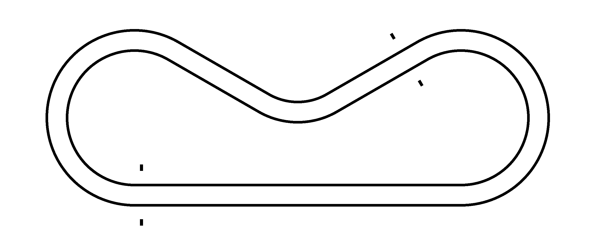
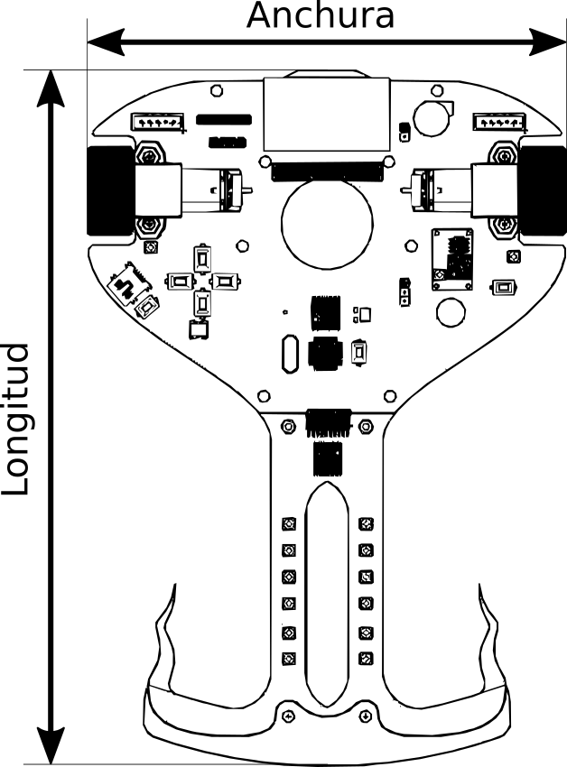

### Reglamento de velocistas de persecución

  - Revisión 1 (2019): vigente desde OSHWDem 2019

#### Objetivo

La categoría de velocistas de persecución consiste en una prueba de velocidad en la que los robots, que compiten entre si, deberán recorrer un circuito de forma autónoma en el menor tiempo posible.

Se trata de un largo recorrido cerrado compuesto por largas rectas y unas curvas muy amplias, de unos 40cm de diámetro.

Esto permite que los siguelíneas puedan alcanzar velocidades muy altas, llegando incluso a los 3 o 4 m/s, incluso más acelerando en las rectas.

#### Circuito

El circuito consiste en una lona blanca de PVC con dos líneas negras que indican la trayectoria que debe seguir el robot. Estas líneas al mismo tiempo se utilizarán como guías que el robot podrá leer para conocer su posición. El sentido de giro queda a elección de la organización del evento, pudiendo no desvelarse hasta el día de la competición.

La trayectoria definida por las líneas será cerrada, es decir, el punto de inicio y el punto de meta serán el mismo.

Las líneas negras tendrán un grosor de **20±2 mm**, y habrá una separación entre sus centros de **20±1 cm**. Las curvas tendrán un radio mínimo de **40±2 cm**. Entre el borde exterior de la lona y el trazado habrá un margen mínimo libre de obstáculos de al menos **10 cm**, al igual que la separación mínima que ha de haber entre el trazado y cualquier obstáculo o impresión (ya sea publicidad o no) en la lona, siendo blanco homogéneo el fondo sobre el que se sitúa el trazado.

En dos zonas del trazado se situarán marcas de salida a ambos lados del recorrido, separadas **10 cm** de las líneas a seguir. Estos dos puntos de salida dividirán el recorrido en dos partes igual de largas, de tal manera que ninguno de los dos robots que compiten en modo persecución tenga ventaja uno sobre el otro, saliendo cada uno desde detrás de una de las líneas de salida.

En el caso de existir elementos tridimensionales tales como curvas peraltadas, puentes, cambios de rasante... etc, se avisará a los participantes antes de la prueba. Adicionalmente, estos elementos serán lisos, sin escalones, y no presentarán inclinaciones mayores de **25º**

La superficie de la pista podrá presentar pequeñas irregularidades, aunque se intentará que sea lo más lisa posible. Además, la pista podrá estar iluminada con diferentes niveles de luminosidad, pero se intentará que la iluminación no sea agresiva y esté distribuida de forma uniforme a lo largo de todo el circuito. No se garantiza la no existencia de flashes u otras perturbaciones lumínicas provocadas por el público en ocasiones puntuales. Adicionalmente, se procurará que la pista se mantenga lo más limpia posible durante el desarrollo de la competición, pudiendo llegar a penalizar a los participantes que pisen y/o ensucien las líneas.

A continuación se muestra un trazado de ejemplo para una competición de velocistas:

#### Robots

Los robots deben ser capaces de desplazarse por el circuito siguiendo una línea marcada en la superficie.
En cuanto a su estructura, deberán cumplir una serie de requisitos de tamaño y peso para poder homologar. Estos requisitos se refieren al robot en estado completo de marcha (con ruedas, baterías... etc), siendo importante que se cumplan durante todo el desarrollo de la prueba.

El peso máximo de los robots será inferior o igual a **2 kg**. Las medidas máximas de los velocistas no deberán superar en ningún caso los **30 cm** de largo, **20 cm** de ancho y **13 cm** de alto. Para asegurar que se cumplen estas medidas podrá emplearse un cajón de verificaciones en el que se deberán introducir los robots antes de competir. En la siguiente figura se muestra cómo debe ser medido un velocista.

El funcionamiento de los velocistas debe ser autónomo, tanto en su sistema de control y su alimentación, y estará integrado en el propio robot.
Si el robot posee algún tipo de comunicación inalámbrica, esta deberá ser mostrada a los jueces con el objetivo de verificar que no se utilizará durante la prueba.

Al inicio, los robots deben estar programados de forma que tras conectarse o pulsar un botón esperen **5 segundos** antes de ponerse en marcha. Si un robot tarda menos de ese tiempo en empezar a moverse será descalificado.

El robot, tanto por construcción o programación, debe permitir su utilización sobre el circuito sin causar ningún daño a este ni a otros robots participantes.

La elección de sensores para los robots y su tipología es libre. Además, se permite que el robot aprenda o memorice el trazado del circuito de manera autónoma durante la competición. No se permite aprender o memorizar el circuito ni programar sus dimensiones en las fases previas a la competición o durante las fases de prueba del circuito.

Se permite el uso de aditivos siempre y cuando estos no degraden o ensucien el circuito. En tal caso los jueces realizarían una advertencia, anulando incluso la ronda de clasificación o concediendo el punto del enfrentamiento en la ronda eliminatoria al robot contrincante. Los jueces podrán comprobar el estado de las ruedas antes de la puesta en marcha del robot, haciéndolas rodar sobre un folio blanco para comprobar si desprenden líquidos o deja marcas de suciedad. Si el robot del competidor advertido reincide ensuciando de nuevo la pista, los jueces podrán descalificarlo.

Se permite el uso de sistemas de ayuda a la tracción como turbinas, alerones móviles, suspensiones, etc.

No se permite sobre el robot ningún tipo de inscripción ni dibujo que pueda atentar contra la dignidad de personas y/o colectivos, consignas políticas o cualquiera otro que pueda considerarse de mal gusto por parte de los jueces.

#### Desarrollo de la prueba

Todos los robots deberán presentarse antes de la competición para su verificación. Una vez verificados, los robots se pondrán en parque cerrado y no se permitirá modificar ni el hardware ni el sofware del robot, salvo en casos excepcionales y bajo la aprobación de los jueces de la competición.

Sí están permitidas las tareas de mantenimiento como la limpieza de los neumáticos y el cambio o carga de baterías.

La prueba se desarrollará en dos fases: clasificación y eliminatorias.

##### Fase de clasificación

Los robots competirán individualmente en **2 intentos** de **1 vuelta** cronometrada al circuito. Solo se tendrá en cuenta el tiempo de la vuelta más rápida para la clasificación y no se permite reprogramar el robot entre intentos.

Se considerará nulo cualquier intento en el que el robot haya efectuado un atajo por el interior de una curva o saltando de un tramo a otro en la trayectoria, saliendo su proyección en planta de las líneas negras a seguir y el espacio englobado entre las mismas. En ese caso el robot perderá el intento de clasificación en el que haya cometido la infracción. En caso de que el robot se salga de pista y se reincorpore a la misma sin haber atajado no se dará por nulo el intento, ya que la pérdida de tiempo por la salida de pista se considerará una penalización en sí misma.

Se permite que el participante elija el carril sobre el que circulará su robot y que éste realice cambios de carril de forma autónoma durante la ejecución de la prueba.

En esta fase de clasificación, la salida y la meta coinciden en la misma línea, donde se colocará un cronómetro que detecte automáticamente el paso del robot para mayor precisión de la medida de tiempos. El robot ha de iniciar la marcha inmediatamente detrás de la línea de salida, imposibilitando una aceleración previa para tomar la salida con velocidad. El cronómetro comenzará a contar el tiempo en el momento en que detecte el paso del robot por la línea de salida y parará una vez el robot vuelva a cruzar la línea.

Si el robot no consigue completar ninguno de los intentos, se tendrá en cuenta la distancia del trazado que haya sido capaz de recorrer para determinar la clasificación. En el caso de que el robot no sea capaz de iniciar la salida por avería o problemas de puesta a punto se le permitirá repetir el intento. Si tras haberlo repetido no consigue iniciar la marcha, se anulará el intento.

Se clasificarán los 4, 8 o 16 robots con mejor tiempo, a elección de la organización del evento, que lo comunicará antes de la realización de la competición. El número de robots clasificados determinará el número de rondas eliminatorias.

IMPORTANTE: En eventos con tiempo limitado, se podrá prescindir de la fase clasificatoria y pasar directamente a la fase eliminatoria con todos los robots participantes. En ese caso, los robots con más puntos en el ranking de la ORS se considerarán los primeros de la clasificación.

##### Fase eliminatoria

Los robots clasificados competirán en parejas en rondas eliminatorias, uno contra uno. Los cruces se realizarán siguiendo la clasificación de la fase anterior, de tal forma que el primero competirá contra el último, el segundo contra el penúltimo, etc. Y en caso de que queden puestos vacantes en los cruces o que se produzca algún abandono, el robot que quede sin rival en su enfrentamiento pasará automáticamente a la siguiente ronda eliminatoria.

Una ronda eliminatoria entre dos robots se compone de **3 enfrentamientos**. Para cada enfrentamiento se colocarán los robots en puntos opuestos del circuito, marcados por las líneas de salida, y encarando la pista en el mismo sentido de giro. Al igual que en la fase clasificatoria, los participantes podrán elegir el carril por el que circule su robot y se permitirá que los robots cambien de carril autónomamente durante la carrera. Cuando el juez marque la salida los participantes activarán sus robots y **5 segundos** después comenzarán a correr. Ganará el enfrentamiento el robot que sea capaz de alcanzar al robot contrario, que permanezca más tiempo en pista o que tras **3 minutos** de haber dado la salida haya recortado mayor distancia respecto a su adversario. En caso de que ninguno de los dos robots inicie la marcha se repetirá el enfrentamiento. Y en caso de empate en la ronda se realizará un cuarto enfrentamiento para determinar el ganador.

Igualmente, se anulará el enfrentamiento en el que un robot ataje en alguna parte del circuito. Se anulará también si al salirse por el exterior invade otro tramo del trazado por donde no debería reincorporarse al circuito, debido al riesgo de colisión frontal entre los robots. Se otorgará el punto del enfrentamiento al robot rival.

El robot que gane una ronda pasará a la siguiente. Se realizará una final por el tercer puesto entre los robots eliminados en semifinales; y una final por el primer puesto entre los robots que consigan ganar todas las rondas previas.

##### Recursos de interés

  * [Raptor](https://bricolabs.cc/wiki/proyectos/raptor)
  * [Cyclops](https://github.com/Resaj/cyclops-project)
  * [Pandatron](https://github.com/JavierIH/pandatron)
  * [VelociBotCBR](http://www.cantabrobots.es/?page_id=179)
  * [Generador de circuitos de velocistas en Octave](https://github.com/Resaj/basic-circuit-maker)

---

Esta obra está bajo una <a rel="license" href="http://creativecommons.org/licenses/by/4.0/">licencia de Creative Commons Reconocimiento 4.0 Internacional.</a>

Reglamento derivado de [Open RoboSports](https://open-robosports.github.io/categorias/velocistas/).