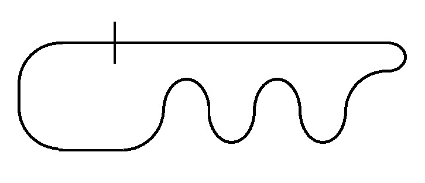

### Regulamento de Segue liñas

  - Revisión 2 (2016): vixente Rev.2

##### Obxectivo

Nesta proba de iniciación valorarase tanto a construcción do robot como o seu desempeño na pista. Cada robot terá dúas oportunidades de percorrer o circuíto no menor tempo posible e recibir a mellor puntuación que poida.
O regulamento detallase a continuación.

##### Sección 1: Definición

Dentro dun área delimitada de uns 4m², se establecerá un percorrido dunha determinada lonxitude de cor negro de 20 mm de ancho e sobre un fondo branco completamente liso. Os robots participantes deberán completar o percorrido dende o punto de partida até o final no menor tempo posible.

##### Sección 2: Trazado

O percorrido do circuíto é pechado, os puntos de saída e chegada son o mesmo. Terá unha lonxitude aproximada de 4 metros e inclúe rectas e curvas de diferentes radios. A curva de menor rádio non será inferior os 125 mm, e a distancia mínima entre duas partes próximas do percorrido non será inferior os 250 mm.
As medidas e percorrido do circuíto no se darán a coñecer até o comezo da proba.

*Fig.1 Exemplo de trazado*

##### Sección 3: Regulamentación para os Robots

 1. A placa controladora do robot, en caso de habela, debe estar baseada en tecnoloxías abertas. Tamén son válidas as plataformas ou kits de robótica baseados en tecnoloxías abertas.
 2. O funcionamento do robot debe ser completamente autónomo. Pódese utilizar calquera método de control, sempre e cando estea integrado enteiramente no robot e non reciba sinais ou indicacións externas (de calquera tipo).
 3. O robot non pode aprender o percorrido do circuíto nin pode programarse para que siga unha ruta predeterminada.
 4. Os robots deberán ter unha masa máxima de 2000 gramos, e se recomenda unhas medidas máximas que non superen os 250 mm de longo e 150 mm de ancho.
 5. O robot debe ter un nome ou número con fins de rexistro e seguimento. O robot debe amosar este nome ou número para permitir a sua identificación á organización e xuíces e os espectadores.
 6. Os robots deben funcionar unicamente coa enerxía proporcionada por pilas ou baterías eléctricas integradas no propio robot.
 
##### Sección 4: Puntuación

 7. Cada robot pode percorrer o circuíto dúas veces e contará para a clasificación o menor dos seus tempos.
 8. O cronómetro de tempo se porá en marcha co primeiro movemento do robot e se deterá o chegar o final do percorrido.
 9. O robot que perda a liña e non consiga voltar o camiño correcto en menos de 10 segundos non percibirá puntos nen será contabilizado o seu tempo.
 10. O robot que se salte parte do percorrido ou non siga a liña non percibirá puntos nin será contabilizado o seu tempo.
 11. O robot que complete todo o percorrido recibirá dous punto e será contabilizado o seu tempo parcial.
 12. O robot gañador determinase pola maior acumulación de puntos.
 
##### Sección 5: Baremo para a asignación de puntos

* Mellor robot con materiais reciclados: 5 puntos.
* Robot máis orixinal: 5 puntos.
* Robot coa mellor documentación online: 6 puntos.
* Cada volta completada: 2 puntos.
* Robot máis rápido 1ª posición: 4 puntos.
* Robot máis rápido 2ª posición: 3 puntos.
* Robot máis rápido 3ª posición: 2 punto.

O baremo é orientativo e pode variar se os xuices o estiman oportuno por cuestions de tempo ou loxística. Nese caso será comunicado aos participantes.
 
##### Sección 6: Xuíces

Na sala haberá en todo momento unha persoa identificada como “xuíz principal” e será a encargada de comunicar calquera decisión final con respecto ao desenvolvemento da competición e interpretación das normas.
Outras persoas poden estar identificadas como “xuíz asistente” e axudarán ao xuíz principal nas tarefas que teña delegadas.
O participante sempre se debe dirixir ao xuíz principal para calquera reclamación ou aclaración das normas. Entón, se o xuíz principal o estima oportuno, pode redirixir ao participante a un xuíz asistente.
As decisións finais sempre as tomará o xuíz principal.

##### Sección 7: Recursos de interese

  * [Tutorial a robot segue liñas básico](http://todohacker.com/tutoriales/tutorial-robot-siguelineas)

----

Esta obra está baixo unha [licenza de Creative Commons Recoñecemento 4.0 Internacional (CC-BY)](http://creativecommons.org/licenses/by/4.0/).

